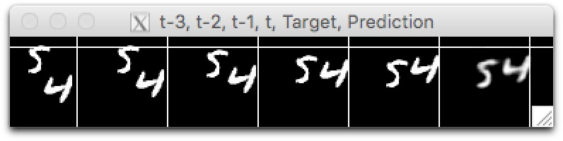

# PredNet in Torch7

A model of [PredNet](https://coxlab.github.io/prednet/) in [Torch7](http://torch.ch/)



## get started:

Download dataset: moving [MNIST examples](https://www.dropbox.com/sh/fvsqod4uv7yp0dp/AAAHoHUjkXg4mW6OvV91TgaEa). Small is a 100-sample test, otherwise use the larger ones with 8000 samples. This dataset originated from [Viorica Patraucean and team](http://mi.eng.cam.ac.uk/~vp344/).

## to train PredNet:

Run: ``th main.lua --useGPU --batch 10 --nlayers 3 -s --savedir results --dataDir dataSets --dataName data-small``` to train on GPU on large dataset, visualize and save model and results.

## to show PredNet outputs with saved model:

Run: ```qlua main.lua --model results --dataDir dataSets --dataName data-small --visOnly --useGPU```

### Notes:
- Data set format: name-train.t7 name-test.t7
- Memory usage: decrease `nSeq` parameter to use less memory. The model is cloned `nSeq` times and therefore memory usage is proportional to it.
